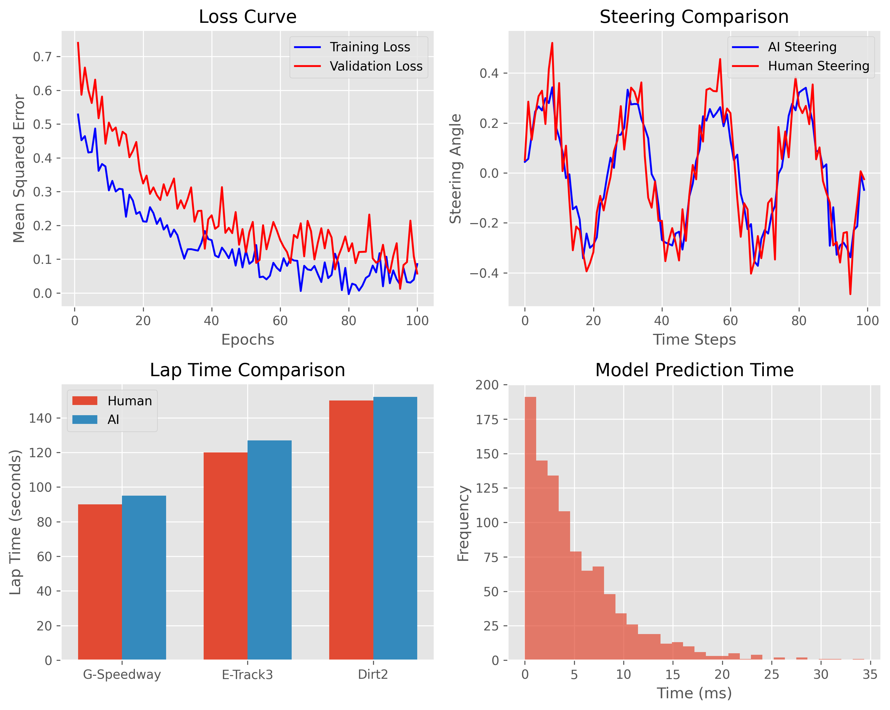

# TORCS Neural Network Driver

An AI-powered autonomous driver for TORCS (The Open Racing Car Simulator) using deep neural networks to learn racing behavior from human demonstration data.


## 🎯 Overview

This project implements an intelligent racing driver that learns to control a race car in TORCS by observing human driving patterns. The system uses a deep neural network to map sensor inputs to control outputs (steering, acceleration, braking, gear shifting).

## ✨ Features

- **Neural Network Driver**: Deep learning model with 9 layers and 2.3M parameters
- **Real-time Control**: Processes 89 sensor inputs to generate 5 control outputs
- **Data Collection**: Automated logging of sensor data and human driving actions
- **Multi-track Support**: Works across different TORCS tracks and car configurations
- **Performance Monitoring**: Built-in debugging and performance metrics

## 🏗️ Architecture


The system consists of three main components:
1. **Data Collection Module** (`pyScrcClient/src/client.py`) - Collects training data from manual and AI driving
2. **Neural Network Model** (`client_model.py`) - Deep feedforward network training
3. **AI Client** (`ai_client.py`) - Real-time driver implementation using trained model

## 📋 Requirements

- Python 3.7+
- TensorFlow 2.x
- NumPy
- Pandas
- Scikit-learn
- Joblib
- TORCS simulator

## 🚀 Installation

1. **Install TORCS**: Download and install TORCS racing simulator
2. **Install Python dependencies**:
   ```bash
   pip install tensorflow numpy pandas scikit-learn joblib matplotlib
   ```

3. **Clone and setup**:
   ```bash
   git clone <repository-url>
   cd Torcs_Driver
   ```

## 💾 Training Data Collection

Training data is collected using the pyScrcClient with both manual driving and a simple rules-based AI agent:

### Manual Driving Data Collection
```bash
cd pyScrcClient/src
python client.py --mode manual --track G-Speedway --car ToyotaCorollaWRC --run_id 1
```

### AI (Rules-based) Data Collection
```bash
cd pyScrcClient/src
python client.py --mode ai --track G-Speedway --car ToyotaCorollaWRC --run_id 2
```

**Available Options**:
- `--mode`: `manual` (keyboard control) or `ai` (rules-based agent)
- `--track`: `G-Speedway`, `E-Track3`, `Dirt2`
- `--car`: `ToyotaCorollaWRC`, `Peugeot406`, `MitsubishiLancer`
- `--run_id`: Unique identifier for the data collection session
- `--host`: TORCS server host (default: `localhost`)
- `--port`: TORCS server port (default: `3001`)
- `--maxEpisodes`: Number of races to run (default: `1`)

**Manual Controls** (when TORCS window is in focus):
- `W/S`: Accelerate/Brake
- `A/D`: Steer left/right
- `Q/E`: Shift down/up
- `Space`: Clutch
- `M`: Toggle between manual/AI modes

Data is automatically saved as CSV files in `pyScrcClient/data/` organized by track and car type.

## 🧠 Model Training

Train the neural network on collected data:

```bash
python client_model.py
```

This creates:
- `model/torcs_model.h5` - Trained neural network
- `model/torcs_model_scaler.pkl` - Data normalization parameters
- `model/training_history.png` - Training progress visualization

## 🎮 Running the AI Driver

Launch the trained AI driver:

```bash
python ai_client.py --model model/torcs_model --logging --debug
```

**Arguments**:
- `--model`: Path to trained model (default: `model/torcs_model`)
- `--host`: TORCS server host (default: `localhost`)
- `--port`: TORCS server port (default: `3001`)
- `--logging`: Enable data logging
- `--debug`: Enable debug output

## 📊 Model Performance



The neural network achieves:
- **Input Features**: 89 sensor readings (track sensors, opponents, speed, etc.)
- **Output Controls**: 5 actions (steering, acceleration, braking, clutch, gear)
- **Architecture**: 9-layer feedforward network
- **Training**: Mean Squared Error loss with Adam optimizer

## 📁 Project Structure

```
├── ai_client.py              # Main AI driver implementation
├── client_model.py           # Data collection and model training
├── model/                    # Trained models and artifacts
│   ├── torcs_model.h5       # Neural network weights
│   ├── torcs_model_scaler.pkl
│   └── training_history.png
├── pyScrcClient/            # TORCS client library
│   └── src/                 # Core driver components
│       └── client.py        # Data collection client
└── docs/                    # Documentation and images
```

## 🏁 Quick Start

1. **Start TORCS** in practice mode
2. **Collect training data**: Run manual and AI driving sessions using `pyScrcClient/src/client.py`
3. **Train model**: Process collected data into neural network using `client_model.py`
4. **Run AI driver**: Deploy trained model for autonomous racing using `ai_client.py`

## 🔧 Technical Details

- **Sensor Inputs**: 19 track sensors, 36 opponent sensors, speed, RPM, gear, etc.
- **Control Outputs**: Continuous steering/acceleration/braking + discrete gear selection
- **Network Architecture**: Deep feedforward with ReLU activations
- **Data Processing**: StandardScaler normalization for stable training

## 📈 Results

The AI driver successfully learns basic racing behaviors including:
- Track following and cornering
- Speed control and braking
- Obstacle avoidance
- Gear shifting strategies

---

*This project demonstrates the application of imitation learning for autonomous vehicle control in a simulated racing environment.* 